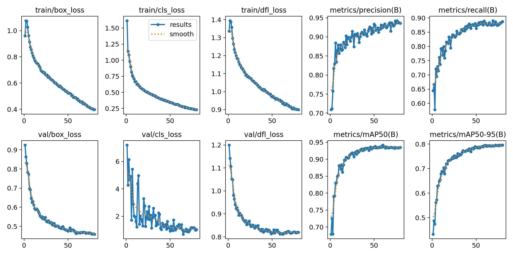
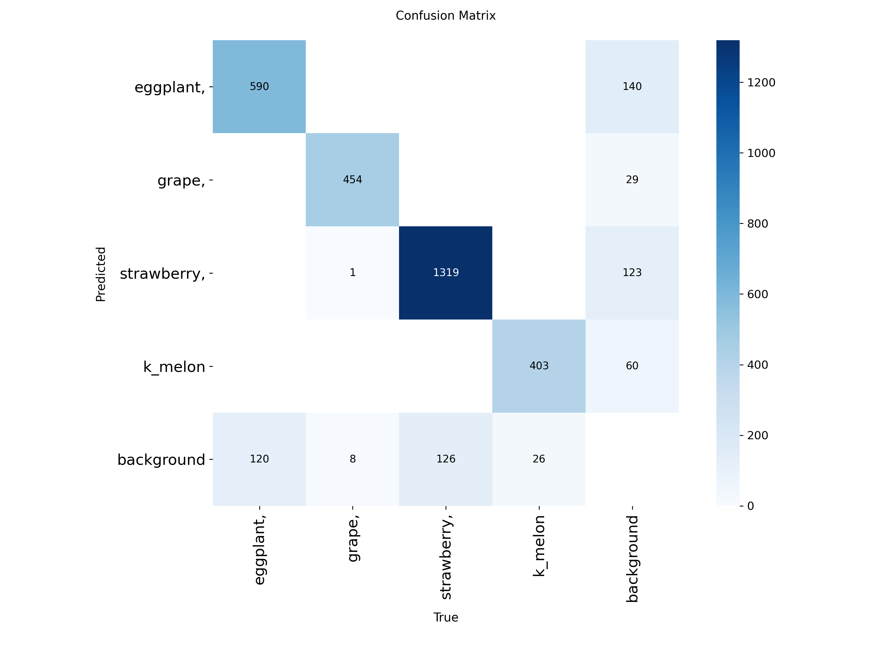

# 작물 탐지 YOLO 모델 — 학습 리포트

객체 판별 AI(작물 종류 탐지) 학습 과정과 결과를 정리한 문서. 학습 코드는 [`training/curriculum_crop_detection_training.ipynb`](../training/curriculum_crop_detection_training.ipynb) 참고.

## 1. 문제 정의

- **목표**: 로봇 카메라가 촬영한 이미지에서 작물 종류를 실시간으로 탐지 (병해충/익음도 판정은 별도 색상 분석 및 외부 API가 담당 — YOLO는 "종류 판별"만 책임지는 구조)
- **클래스 (4개)**: `eggplant`(가지), `grape`(포도), `strawberry`(딸기), `k_melon`(참외)
- **베이스 모델**: `yolov8s.pt` (전이학습)

## 2. 데이터셋 구성

라벨링 진행 현황 (`AI_데이터정리.xlsx` 기준):

| 작물 | 전체 수집 이미지 | 라벨링 완료 | 정상 라벨 | 병해 라벨 |
|---|---:|---:|---:|---:|
| 딸기 (strawberry) | 19,679 | 10,000 | 8,189 | 1,811 |
| 가지 (eggplant) | 34,237 | 10,000 | 9,112 | 888 |
| 참외 (k_melon) | 19,329 | 10,000 | 9,149 | 851 |
| 포도 (grape) | 17,880 | 10,000 | 9,779 | 221 |

최종 학습에 사용된 클래스별 이미지 수(정상+병해 합산, background 포함):

| 클래스 | 이미지 수 |
|---|---:|
| strawberry | 4,502 |
| eggplant | 1,509 |
| grape | 1,500 |
| k_melon | 640 |
| background(negative) | 906 |

> **참고**: `k_melon`은 수집된 병해 이미지가 0건으로 확인됨 — 참외 병해 데이터 자체가 부족했던 것이 원인이며, 향후 데이터 보강이 필요한 부분으로 남겨둠.

### 데이터 처리 방식

- **Train/Val 분할**: 클래스 단위 7:3 층화 분할 (`random.seed(42)`) — 클래스 간 이미지 수 편차가 커서 단순 랜덤 분할 대신 클래스별 균등 분할 적용
- **Background(negative) 샘플링**: 작물이 없는 배경 이미지를 최종 데이터셋의 약 5~10% 비율로 섞어 빈 라벨로 포함 → 오탐(작물이 없는데 있다고 판단) 억제 목적

## 3. 학습 설정

| 항목 | 값 |
|---|---|
| Base model | yolov8s.pt |
| Epochs | 80 (patience=20, 조기 종료 가능) |
| Image size | 학습 640 → **배포 시 1280으로 변경** (아래 4번 참고) |
| Batch size | 16 |
| Augmentation | **커리큘럼 러닝**: mosaic/mixup을 epoch 진행도에 따라 3단계로 점진 증가 |

### 커리큘럼 러닝 (직접 구현)

`on_train_epoch_start` 콜백으로 Ultralytics 학습 루프는 그대로 두고 증강 강도만 스케줄링:

- 진행도 0~30%: mosaic 0→목표치로 점증, mixup 미적용 (쉬운 샘플 우선)
- 진행도 30~70%: mosaic·mixup 동시 증가
- 진행도 70~100%: 최대 강도로 고정

## 4. 결과

### 4-1. 학습 곡선 (`training_results.png`)

- box/cls/dfl loss 모두 train/val 공통으로 안정적으로 감소 (val/cls_loss는 노이즈가 있지만 하락 추세 유지)
- **mAP50 ≈ 0.93, mAP50-95 ≈ 0.80**까지 상승 후 50~60 epoch 부근부터 평탄화 → `patience=20` 조기 종료 설정이 합리적이었음을 뒷받침
- precision/recall도 각각 0.93/0.88 수준까지 꾸준히 상승

### 4-2. 혼동행렬 (`confusion_matrix.png`)

- 4개 클래스 모두 대각선에 대부분 몰려 있어 클래스 간 상호 오분류는 거의 없음 (예: grape→strawberry 오분류 1건 수준)
- 가장 큰 오류 패턴은 **각 클래스 → background 오분류**: eggplant 140건, strawberry 123건, k_melon 60건, grape 29건
  - 반대로 background → 각 클래스 오분류(실제 배경인데 작물로 오탐)도 존재 (eggplant 120건, strawberry 126건, k_melon 26건)
  - 즉 두 방향 모두에서 "작물 vs 배경" 경계가 세부 클래스 간 구분보다 상대적으로 어려운 지점으로 확인됨 → 배경 negative 샘플 비율/다양성 확대가 다음 개선 포인트

### 4-3. 배포 시 추론 해상도 조정

학습은 `imgsz=640`으로 진행했지만, 실측 결과 640 대비 1280에서 작거나 멀리 있는 객체 탐지력이 크게 개선되는 것을 확인해 **실제 로봇 배포 시에는 `imgsz=1280`으로 추론**하도록 `config.py`에 반영함 (단, 화면을 꽉 채운 큰 객체는 오히려 놓칠 수 있는 트레이드오프가 있어 비동기 추론과 함께 적용).

## 5. 향후 개선 방향

- `k_melon` 병해 데이터 보강
- background negative 샘플 비율/다양성 조정하여 배경 오분류 감소
- `CROP_COLOR_PROFILES`의 `disease_threshold`(현재 임시값) 실측 재보정
