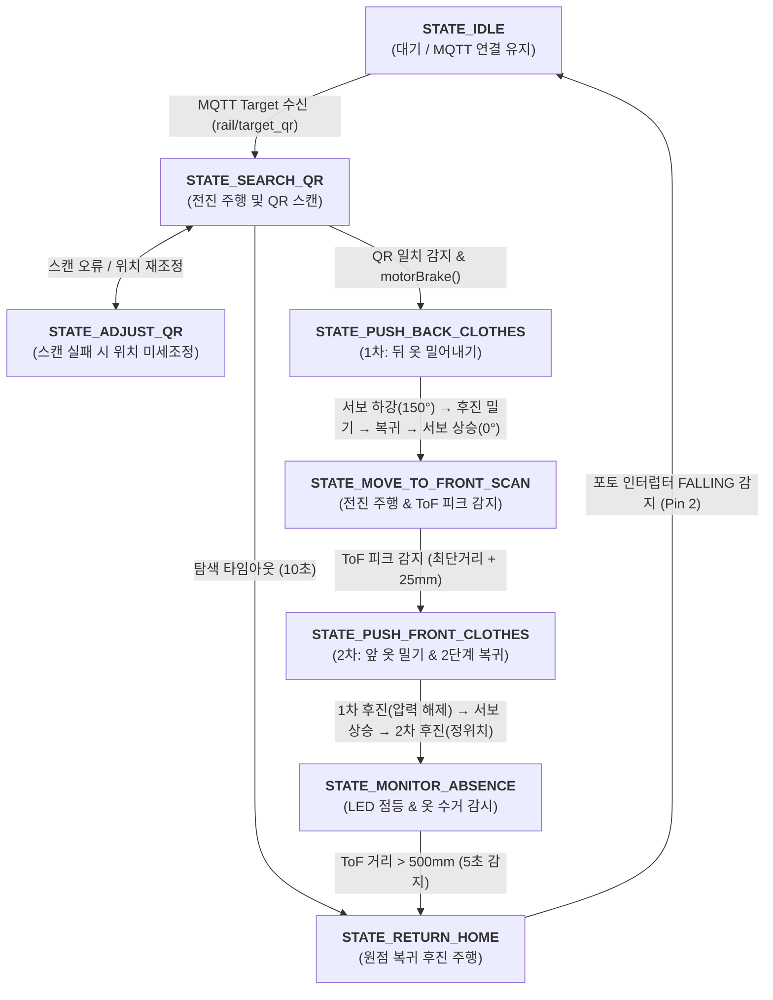

👔 Smart Hanger: On-Device Edge AIoT 스마트 의류 관리 로봇
<p align="left">
  
  
  
  
</p>
---
📖 1. 프로젝트 개요 (Project Overview)
프로젝트명: Smart Hanger (물리적 공간 확보 메커니즘 기반 지능형 홈 AIoT 행거 시스템)
진행 기간: 2026.07.06 ~ 2026.08.14 (6주)
팀 구성 / 담당 역할: 5인 팀 (팀명: 2게되네) / 팀장 (Team Leader), HW 기구 설계 및 임베디드 제어 펌웨어 전담 개발
개발 목표: 의류 자동 탐색 및 공간 확보 메커니즘(로봇), 비전 AI(YOLO) 기반 의류 인식, 데이터베이스 및 사용자 맞춤형 추천(LLM) 기능을 융합한 엔드투엔드(E2E) 스마트 행거 시스템 개발
핵심 차별성: 단순 정보 표시나 회전형 행거를 넘어, 상단 레일 로봇이 타겟 의류 앞·뒤의 옷들을 물리적으로 밀어내어(양방향 젖힘) 인출 공간을 확보해 주는 물리적 AIoT 솔루션
---
🏗️ 2. 시스템 아키텍처 (System Architecture)
```text
[ Android Client (App) ]
    │  ▲
    │  │ HTTP REST (의류 목록 조회 / 맞춤 코디 추천 요청)
    ▼  │
[ Raspberry Pi 4 (Edge Server Node) ]
    ├─ FastAPI Backend Server (로컬 REST API)
    ├─ On-Device LLM (기상·일정 데이터 기반 코디 분석)
    ├─ YOLOv8 Vision Pipeline (의류 비전 인식/분류)
    └─ Mosquitto MQTT Broker (Port: 1883)
            │
            │ Topic: "rail/target_qr" (타겟 의류 ID 실시간 발행)
            ▼
[ Arduino UNO R4 WiFi (Robot Cart) ]
    ├─ FSM 메인 제어 펌웨어
    ├─ L298N DC 모터 드라이버 (주행 및 전자 급제동)
    ├─ 서보 모터 (양방향 옷 젖힘 암 구동)
    ├─ VL53L0X ToF 센서 (옷 중심 피크 감지 & 인출 감시)
    ├─ UART 바코드/QR 스캐너 (의류 태그 실시간 식별)
    ├─ 포토 인터럽터 (원점 홈 포지션 감지)
    └─ WS2812B NeoPixel (타겟 의류 하이라이트 조명)
```
---
🛠️ 3. 하드웨어 핀맵 (Hardware Pin Map)
분류	핀 번호	연결 소자 / 모듈	프로토콜 / 신호	상세 기능 설명
원점 감지	`D2`	포토 인터럽터 (Photo Interrupter)	External INT (`FALLING`)	카트 원점(Home Position) 도착 감지 및 정지 인터럽트
모터 속도 제어	`D3`	L298N 모터 드라이버 (`ENB`)	Timer PWM (8-bit)	GA12-N20 DC 모터 주행 속도 제어
모터 방향 제어	`D4`, `D5`	L298N 모터 드라이버 (`IN3`, `IN4`)	GPIO Output	정회전(전진), 역회전(후진) 및 양단 쇼트 급제동(`motorBrake`)
상태 표시 조명	`D7`	WS2812B NeoPixel LED (8구)	Single-Wire Digital	타겟 의류 위치 표시용 백색 조명 제어
기구부 서보	`D9`	SG90 / MG996R 서보 모터	PWM (Servo library)	의류 젖힘용 서보 암 각도 제어 (대기: 0° $\leftrightarrow$ 동작: 150°)
거리/피크 감지	`SDA`, `SCL`	VL53L0X ToF 거리 센서	I2C (Wire, 100kHz)	의류 중심 피크 검출 및 인출 감시 (500mm 기준)
바코드/QR 인식	`Pin 0(RX)`, `Pin 1(TX)`	바코드/QR 스캐너 모듈	UART (`Serial1`, 115200 bps)	의류 옷걸이 태그 ID 실시간 스캔 및 수신
---
🔄 4. 펌웨어 상태 머신 (FSM Architecture)
1. 상태 전이 흐름도 (Mermaid Diagram)

2. 세부 상태 정의 (State Definitions)
`STATE_IDLE` (0): 대기 상태. MQTT 토픽 구독 및 원격 UDP 제어 명령 수신 대기
`STATE_SEARCH_QR` (1): 전진 주행하며 옷걸이 태그의 바코드를 실시간 스캔
`STATE_ADJUST_QR` (2): 스캔 오류 발생 시 전/후진 미세 조정을 통한 위치 재보정
`STATE_PUSH_BACK_CLOTHES` (3): 목표 태그 일치 즉시 급제동 후, 서보 암을 내려 뒤쪽 옷을 밀어내어 1차 공간 확보
`STATE_MOVE_TO_FRONT_SCAN` (4): 서보 암을 올린 상태로 전진하며 ToF 센서로 옷걸이 중심 두께 피크점 통과 탐색
`STATE_PUSH_FRONT_CLOTHES` (5): 서보 암을 내려 앞쪽 옷을 밀어내고, 2단계 분리 복귀 알고리즘으로 타겟 정위치 정렬
`STATE_MONITOR_ABSENCE` (6): 백색 조명 점등 후 ToF 거리 측정으로 사용자의 의류 수거 여부 모니터링
`STATE_RETURN_HOME` (7): 수거 확인 후 포토 인터럽터 센서가 감지될 때까지 후진하여 원점 복귀
---
💡 5. 핵심 엔지니어링 문제 해결 (Deep Troubleshooting)
📌 1. 주행 메커니즘 전면 개편 (와이어 구동 → 랙 앤 피니언 기어)
문제 상황: 초기 낚싯줄 견인 구동 시 카트 로봇의 자중 및 전·후진 가감속 관성으로 인해 줄 늘어짐과 휠 슬립(공회전) 발생, 목표 위치 제어 실패
원인 분석: 와이어의 탄성 변형과 마찰 구동 방식의 한계로 인해 모터 회전수와 실제 이동 거리 간의 누적 오차 발생
해결 방안: 상단 레일에 랙(Rack) 기어를 배치하고 모터 축에 피니언(Pinion) 기어를 직접 맞물리는 기어 치합 구조로 전면 3D CAD 재설계 및 출력
결과: 주행 슬립을 100% 제거하고 부하 상황에서도 탈조 없는 정밀 선형 이동 구현
📌 2. 서보 기구 끼임 방지 (2-Step Return 분리 복귀 알고리즘)
문제 상황: 앞 옷 밀기 완료 후 서보 암을 위로 올릴 때, 압축된 옷걸이들의 반발력으로 인해 서보 암이 끼어 모터 과부하 및 기구 파손 발생
원인 분석: 옷이 밀려 압축된 상태에서 수직 상향으로 서보 암을 회전시키려 하여 강한 전단 응력 작용
해결 방안:
1차 후진 (끼임 해제): 서보 암이 내려간 상태 그대로 1.5초 후진(`TIME_PUSH_FRONT_RETURN_MS`)하여 옷걸이와의 압착력 해제
서보 상승: 무부하 상태에서 안전하게 서보 암 상승 (`SERVO_ANGLE_UP`)
2차 후진 (정위치 복귀): 서보가 올라간 상태에서 1.5초 추가 후진(`TIME_RETURN_TO_TARGET_MS`)하여 타겟 의류 정위치 정렬
결과: 기구 걸림 및 서보 모터 기어 파손 0건 달성
📌 3. 관성 오버슈트 방지 (전자 급제동 `motorBrake` & ToF 피크 검출)
문제 상황: 고속 탐색 주행 중 목표 바코드를 인식한 즉시 모터 출력을 차단(`analogWrite(0)`)해도 관성에 의해 목표 지점을 약 20~30mm 지나쳐 정지
원인 분석: N20 감속 모터 및 카트 자중에 의한 기계적 주행 관성 잔존
해결 방안:
바코드 일치 인터럽트 발생 즉시 모터 드라이버 양단을 쇼트(`IN3=HIGH, IN4=HIGH`)시키는 역기전력 전자 급제동(`motorBrake()`) 로직 구현
ToF 센서 최단 거리 추적 알고리즘(`minObservedDist + PEAK_DELTA_MM`)을 결합하여 옷걸이 중심 통과 시점을 정확히 검출
결과: 목표 바코드 정차 오차 ±5mm 이내 정밀 제어 달성
📌 4. 온디바이스(Edge AI) 아키텍처 피봇
문제 상황: 초기 클라우드(AWS) 기반 아키텍처 사용 시 옷장 내부 이미지의 외부 전송에 따른 개인정보 유출 우려 및 네트워크 딜레이/패킷 손실 발생
원인 분석: 외부 퍼블릭 네트워크 의존성 및 고화질 이미지 전송 시 통신 병목 현상 발생
해결 방안: AWS 클라우드를 전면 배제하고 라즈베리파이 4를 Edge Node로 구축하여 FastAPI 백엔드, 경량 LLM, YOLO 비전, Mosquitto MQTT 브로커를 내부 폐쇄망으로 통합
결과: 프라이버시 이슈 원천 차단 및 통신 레이턴시 단축을 통한 실시간 응답성 확보
---
🎬 6. 최종 시스템 동작 시퀀스 (Full Demonstration Flow)
사용자 호출: Android 앱에서 날씨/일정 기반 추천 코디 선택 → MQTT (`rail/target_qr`)로 타겟 의류 ID 발행
탐색 주행: UNO R4가 모터 구동 → 바코드 스캐너(UART)로 옷걸이 태그 실시간 스캔
1차 젖힘 (뒤 옷 밀기): 목표 QR 일치 즉시 급제동 → 서보 하강 → 후진 밀기 → 뒤 옷 공간 확보
2차 젖힘 (앞 옷 밀기 & 복귀): 전진 주행 → ToF 피크 감지 → 서보 하강 후 전진 밀기 → 2단계 분리 복귀로 타겟 정위치 정렬
조명 및 수거 감시: WS2812B White LED 점등 → ToF 센서로 실시간 거리 감시(500mm 초과 시 옷 꺼냄 감지)
자동 원점 복귀: 옷 수거 감지 5초 후 포토 인터럽터(원점 센서)까지 후진 복귀 후 대기 모드 진입
---
📂 7. 디렉토리 구조 (Directory Structure)
```text
├── README.md
├── firmware/
│   └── smart_hanger_uno.ino       # 아두이노 UNO R4 FSM 메인 제어 펌웨어
├── server/
│   ├── main.py                   # FastAPI 로컬 백엔드 서버
│   ├── mqtt_manager.py           # Mosquitto MQTT 송수신 매니저
│   └── llm_recommender.py        # 기상/일정 기반 로컬 LLM 코디 추천 모듈
├── app/                          # Android Studio 클라이언트 프로젝트 소스코드
└── cad/                          # 랙 앤 피니언 레일 및 카트 프레임 3D 모델 (.stl)
```
---
👥 8. 팀원 구성 및 역할 분배 (Team Roles & Responsibilities)
성명	직책 / 담당 파트	주요 기여 내용
심승종	팀장 / HW & 임베디드	• 시스템 HW 아키텍처 설계, 전원 분배 및 L298N 회로 배선<br>• 아두이노 UNO R4 FSM 제어 펌웨어 및 센서 인터페이스 전담 개발<br>• 2단계 분리 복귀 알고리즘 및 전자 급제동(`motorBrake`) 구현
김태영	팀원 / 기구 설계 & CAD	• 스마트 행거 섀시 구조 설계 및 3D 모델링<br>• 랙 앤 피니언 기어 메커니즘 3D 프린팅 및 정밀 조립
양성진	팀원 / 비전 & 엣지 인터페이스	• 라즈베리파이 카메라 비전(YOLO/바코드) 파이프라인 구축<br>• 하드웨어-엣지 간 네트워크 통신 및 데이터 파싱
나종만	팀원 / AWS 서버 구축	• 초기 AWS 클라우드 서버 인프라 구축 및 API 통신 환경 구성<br>• 온디바이스 전환 지원 및 데이터베이스 연동 관리
김송은	팀원 / 안드로이드 앱 개발	• Android UI/UX 디자인 및 4대 핵심 탭(Home/Closet/Recommend/Calendar) 구현<br>• REST API 및 MQTT 브로커 실시간 연동

